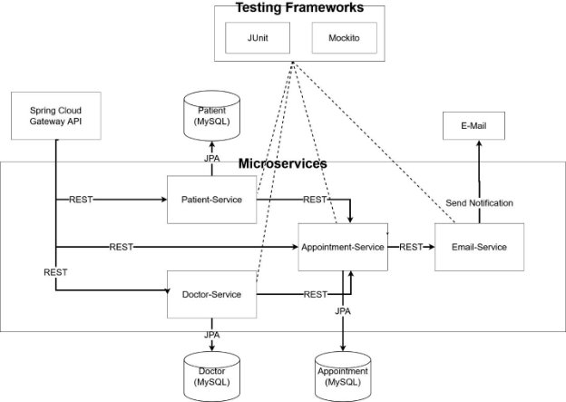
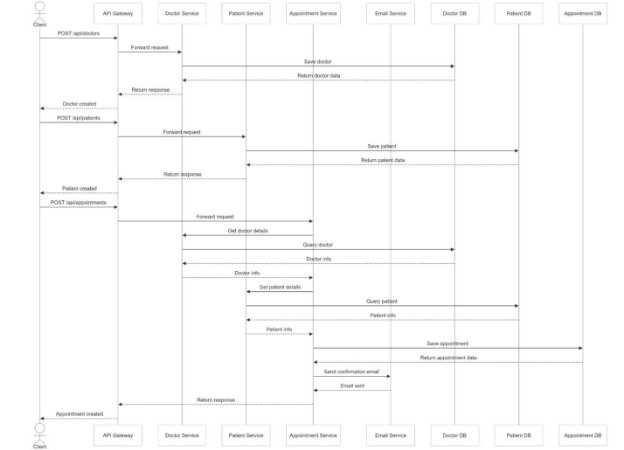
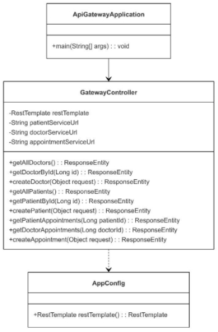
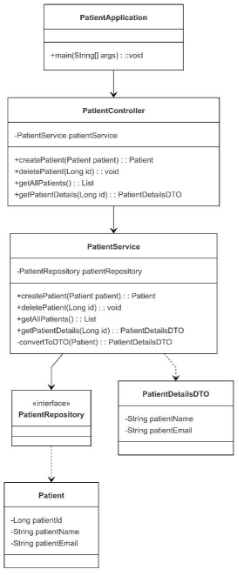
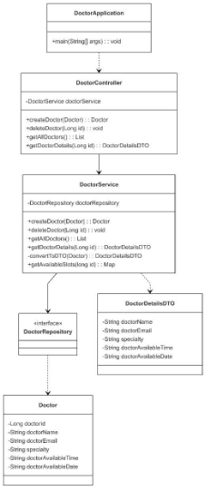
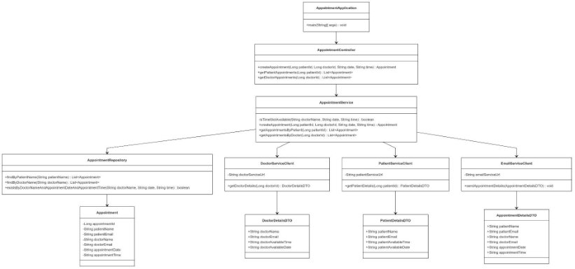
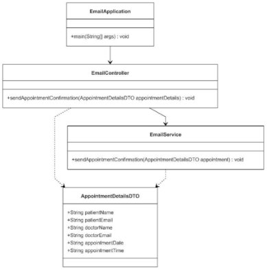

**COMP301 - Software Architecture and Tools Microservice Term Project Report** 

**Submitted By:** 

- Suay İlseven (appointment service) 
- Melih Emir Güner (api gateway) 
- Ömer Faruk Gündoğdu (patient service) 
- Magzhan Ahmedi (doctor service) 
- Kaan Akkök (email service) 

**Submitted To: Asst. Prof. Kemal Çağrı Serdaroğlu Date: 16/01/2025** 

**Section: 2** 

**HealthSync (Healtcare System):** 

HealthSync is a healthcare appointment system that streamlines patient records, doctor schedules, and appointment bookings using a microservices architecture. 

**Abstraction :**  

HealthSync  is  a  comprehensive  healthcare  appointment  system  designed  with microservices architecture. The project aims to streamline the management of patient records, doctor schedules, and appointment bookings, facilitating seamless interactions between patients and doctors. Utilizing modern technologies such as Spring Boot and RESTful APIs, HealthSync offers  a  scalable  and  maintainable  platform.  The  system's  modular  design  allows  for  easy integration and expansion, making it a robust solution for appointment systems. 

**Introduction :** 

HealthSync is a healthcare appointment system developed to address the growing need for efficient management of healthcare services. In nowadays, healthcare providers face challenges in managing patient records, doctor schedules, and appointment bookings. HealthSync aims to solve these issues by using a microservices architecture, which allows for flexibility and scalability. The project uses modern technologies like Spring Boot and RESTful APIs to create a modular platform that enhances communication between patients and doctors. 

The importance of this project lies in its ability to improve operational efficiency and patient satisfaction. HealthSync reduces complex appointment jobs and allows doctors to focus more on patient care. The system's modular design ensures easy integration with existing systems and future expansions. 

This report will explain of the project details and the methods and technologies that we use for developing HealthSync (healthcare appointment system) with microservice architecture. 

**Design :** 

The design of the HealthSync system is centered around a microservices architecture, where each service is responsible for a specific domain within the healthcare appointment system. This modular approach allows for scalability, maintainability, and ease of integration. Below is an explanation of each service and its design, along with relevant diagrams.  

**System Desing:** 

**Sequence Diagram:** 

**1. API Gateway** 

**Purpose:** The API Gateway acts as a single entry point for all client requests. It routes requests to the appropriate microservices, providing a layer of abstraction and simplifying client interactions. The server port number of this service is 8080. 

- **Components:** 
1. GatewayController: Handles incoming HTTP requests and forwards them to the respective services. 
1. AppConfig (RestTemplate): Used for making HTTP requests to other services. 
- **Class Diagram:** 

**2. Patient Service** 

**Purpose:** Manages patient information, including registration, updates, and retrieval of patient data. The server port number of this service is 8081. 

- **Components:** 
1. PatientController: Exposes RESTful endpoints for patient operations (e.g., create, update, delete, get). 
1. PatientService: Contains business logic for managing patients. Handles patient data. 
1. PatientRepository: Interfaces with the database to perform CRUD operations on patient data. Uses Spring Data JPA for database interactions. 
1. Patient: Entity class representing the doctor data model. Includes fields like patient id, patient name, patient email. Connected to MySQL database. 
5. PatientDetailsDTO: Data Transfer Object for appointment service. Includes fields like patient name and patient email. 
- **Class Diagram:** 

**3. Doctor Service** 

**Purpose:** Handles doctor-related data, including registration, specialty, availability. The server port number of this service is 8082. 

- **Components:** 
1. DoctorController: Exposes RESTful endpoints for doctor operations (e.g., create, update, delete, get). 
1. DoctorService: Contains business logic for managing doctors. Handles doctor data. 
3. DoctorRepository: Interfaces with the database to perform CRUD operations on doctor data. Uses Spring Data JPA for database interactions. 
3. Doctor: Entity class representing the doctor data model. Includes fields like doctor id, doctor name, doctor specialty, doctor email, doctor availableTime, and doctor availableDate. Connected to MySQL database 
3. DoctorDetailsDTO: Data Transfer Object for appointment service. Includes fields like doctor name, doctor email, doctor specialty, doctor availableTime and doctor availableDate. 
- **Class Diagram:** 

**4. Appointment Service** 

**Purpose:** Facilitates the booking and management of appointments between patients and doctors. The server port number of this service is 8083. 

- **Components:** 
1. AppointmentController: Exposes RESTful endpoints for appointment operations (e.g., create, update, delete, get). 
1. AppointmentService: Contains business logic for managing appointments. Checks doctor availability and schedules appointments with the patient.** 
1. AppointmentRepository: Interfaces with the database to perform CRUD operations on appointment data. Uses Spring Data JPA for database interactions.** 
1. Appointment: Entity class representing the doctor data model. Includes fields like appointment  id,  patient  name,  patient  email,  doctor  name,  doctor  email, appointment date, appointment time. Connected to MySQL database. 
1. DoctorServiceClient:  With  RestTemplate  implementation,  Clients  gets doctorDetailsDTO from doctor service with this url: http://localhost:8082. 
1. PatientServiceClient:  With  RestTemplate  implementation,  Clients  gets patientDetailsDTO from patient service with this url: http://localhost:8081. 
1. EmailServiceClient:  With  RestTemplate  implementation,  Clients appointmentDetailsDTO to email service with this url: http://localhost:8084. 
1. AppointmentDetailsDTO: Data Transfer Object for email service. Includes fields like patient name, patient email, doctor name, doctor email, appointment date, appointment time. 
1. DoctorDetailsDTO: Data Transfer Object for appointment service. Includes fields like doctor name, doctor email, doctor specialty, doctor availableTime and doctor availableDate. 
1. PatientDetailsDTO: Data Transfer Object for appointment service. Includes fields like patient name and patient email. 
1. AppConfig (RestTemplate): Used for making HTTP requests to other services. 

**General Class Diagram:

**

**5. Email Service** 

**Purpose:** Sends notifications to patients and doctors regarding appointments. The server port number of this service is 8084. 

- **Components:** 
1. EmailController: A Rest controller that exposes endpoints for email related operations, like sending appointment confirmations. 
1. EmailService:  Contains methods for sending  email  notifications. Simulates email sending for appointment confirmations and reminders. 
1. AppointmentDetailsDTO: Data Transfer Object, used to encapsulate the details of an appointment. This DTO includes fields like patient name, patient email, doctor name, doctor email, appointment date, appointment time. 

**Testing :** 

- **Doctor Service:** 
1. DoctorServiceTest: Focus on testing individual methods of the doctor Service class in isolation, using mock objects to simulate external dependencies. 
   1) getAllDoctors\_ShouldReturnListOfDoctors():Ensures that all doct ors are retrieved from the repository. 
   1) getDoctorDetails\_ShouldReturnDoctorDTO():  Verifies  that  a doctor's details are returned as a DTO. 
1. DoctorIntegrationTest: Verify the complete flow of the application, ensuring that all components interact correctly and the endpoints behave as expected. 
1) getAllDoctors\_ShouldReturnDoctorList():Verifies that a list of doc tors is returned. 
1) getDoctorDetails\_ShouldReturnDoctor():Checks that doctor details  are retrieved correctly. 
- **Patient Service:** 
1. PatientServiceTest: Focus on testing individual methods of the Patient Service class in isolation, using mock objects to simulate external dependencies. 

1) getAllPatients\_ShouldReturnListOfPatients():  Ensures  that  all patients are retrieved from the repository. 
1) createPatient\_ShouldReturnSavedPatient():Verifies that a patient is  saved and returned correctly. 
2. PatientIntegrationTest: Verify the complete flow of the application, ensuring that all components interact correctly and the endpoints behave as expected. 
1) createPatient\_ShouldReturnSuccess(): Verifies that a new patient can be created successfully. 
1) getPatientDetails\_ShouldReturnPatient():Checks that patient details can be retrieved correctly 
- **Appointment Service:** 
1. AppointmentServiceTest: Focus on testing individual methods of the Appointment Service class in isolation, using mock objects to simulate external dependencies. 
1) createAppointment\_ShouldCreateAppointmentSuccessfully(): Ensures successful creation of an appointment. 
1) createAppointment\_ShouldThrowException\_WhenTimeSlotNotA vailable(): Verifies exception handling for unavailable time slots. 
1) getAppointmentsByPatient\_ShouldReturnPatientAppointments(): Checks retrieval of patient appointments. 
1) getAppointmentsByDoctor\_ShouldReturnDoctorAppointments(): Checks retrieval of doctor appointments. 
2. AppointmentIntegrationTest: Verify the complete flow of the application, ensuring that all components interact correctly and the endpoints behave as expected. 
1) createAppointment\_ShouldReturnSuccess():  Verifies  that  an appointment can be created successfully. 
1) getAppointmentsByPatient\_ShouldReturnAppointments():  Checks that appointments for a patient are retrieved. 
1) getAppointmentsByDoctor\_ShouldReturnAppointments():  Checks that appointments for a doctor are retrieved. 

**a)  Email Service:** 

1. EmailServiceTest: Focus on testing individual methods of the Email Service class in isolation, using mock objects to simulate external dependencies. 
   1) sendAppointmentConfirmation\_ShouldSendEmailSuccessfully(): Ensures that the email sending logic executes without exceptions. 
1. EmailIntegrationTest: Verify the complete flow of the application, ensuring that all components interact correctly and the endpoints behave as expected. 

a)  sendEmail\_ShouldReturnSuccess(): Verifies that an email can be 

sent successfully. 

**Methodology :** 

1. **Architecture & Patterns:** 
- Microservices Architecture 
- REST API Design 
- Repository Pattern 
- DTO Pattern 
- Gateway Pattern 
2. **Tools & Technologies:** 
- spring-boot-starter-web 
- spring-boot-starter-data-jpa 
- mysql-connector 
- spring-boot-starter-test 
- h2database (for testing) 
- springdoc-openapi-starter-webmvc-ui (swagger ui – to see rest connections) 
- Lombok 
3. **Microservices:** 
- API Gateway (Port: 8080) 
- Patient Service (Port: 8081) 
- Doctor Service (Port: 8082) 
- Appointment Service (Port: 8083) 
- Email Service (Port: 8084) 
4. **Testing Strategy:** 
- Unit Tests (JUnit 5) 
- Integration Tests 
- Mock Testing (Mockito) 
- H2 In-Memory Database 
5. **Database:** 
- MySQL 
- JPA/Hibernate 
- Separate database per service 
6. **Documentation:** 
- OpenAPI/Swagger 
7. **Development Principles:** 
- SOLID Principles 
- DRY (Don't Repeat Yourself) 
8. **Service Communication:** 
- RestTemplate 
- HTTP/REST 
- Synchronous communication 
9. **Build:** 
- Maven 
- Java 17 
- Spring Boot 3 

**Further Studies and Recommendations:** 

- We  can  add  authorization  and  authentication  services  to  manage  doctor  and  patient authorization and authentication processes.** 
- We can make extra enchantment over services. For examples adding SMS sender.** 
- We can deploy the project and implement Eureka** 

**Conclusion and Discussion:** 

In conclusion, HealthSync successfully achieved its goal of creating a scalable and modular healthcare appointment system using microservices architecture. The project streamlined patient records, doctor schedules, and appointment bookings, aligning well with its objectives. 

During development, we faced challenges such as communication issues between services, MySQL errors, and project setup difficulties. These required debugging and redesigning certain parts of the system. We also had to revise our project plan multiple times to address technical complexities and improve performance. 

Despite  these  challenges,  the  project  provided  valuable  insights  about  microservice architecture, real-world development with the team and highlighted the importance of thorough testing. Future enhancements like authentication and deployment can further improve the system’s functionality. 

**Resources:** 

- [https://www.udemy.com/course/microservices-with-spring-boot-and-spring-cloud/ ](https://www.udemy.com/course/microservices-with-spring-boot-and-spring-cloud/)
- Course  resources  (SOLID,  POM.xml,  project  directory,  Synchronous  communication, HTTP/REST) 
- [https://www.youtube.com/watch?v=W1q93Lp_04I ](https://www.youtube.com/watch?v=W1q93Lp_04I)
- [https://www.youtube.com/playlist?list=PLSVW22jAG8pDeU80nDzbUgr8qqzEMppi8 ](https://www.youtube.com/playlist?list=PLSVW22jAG8pDeU80nDzbUgr8qqzEMppi8)
- [https://www.baeldung.com/rest-template ](https://www.baeldung.com/rest-template)
- [https://dileksen3417.medium.com/swagger-ui-nedir-2e2a4e5dc882 ](https://dileksen3417.medium.com/swagger-ui-nedir-2e2a4e5dc882)
